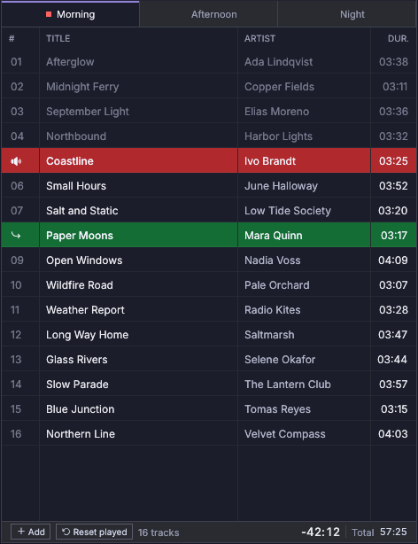
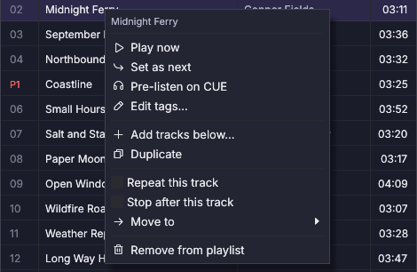
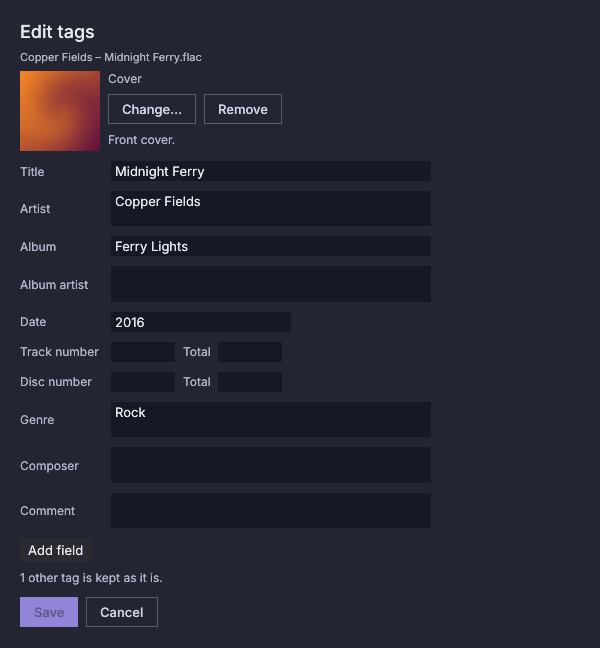

# Llistes de reproducció

## Pestanyes {#tabs}

Cada reproductor té una fila de pestanyes, una per llista. Tots els
reproductors veuen les mateixes llistes; cadascun tria quina mostra. Un punt
en una pestanya indica on són les pistes del reproductor: **vermell** per a la
pista en antena, **verd** per a la següent.

Les pestanyes es reparteixen l'amplada del reproductor. Un nom que no hi cap
acaba amb «…»; posa-hi el ratolí a sobre per llegir-lo sencer. Amb moltes
llistes, les pestanyes deixen d'encongir-se a partir d'una amplada mínima,
apareixen fletxes als extrems de la fila i la roda del ratolí sobre les
pestanyes les desplaça. La pestanya que tries, i la que mostra un
reproductor, es porta a la vista.

Canviar de pestanya mai no canvia el que és en antena ni el que és següent.
Quan una pista acaba, el reproductor continua a la llista que conté aquesta
pista.

Les llistes es creen, se'ls canvia el nom i s'eliminen a
[Configuració](settings.md). L'última llista, i una llista amb una pista en
antena, no es poden eliminar.

## La taula de pistes {#the-track-table}

| Columna | Contingut |
|---|---|
| `#` | Posició, amb zeros a l'esquerra; una icona la substitueix a la pista actual i a la següent |
| Títol | De les etiquetes, o el nom del fitxer (`Artist - Title.mp3` es divideix). Les icones de repetició i de stop al final d'una pista van davant seu |
| Artista | De les etiquetes; «Artista desconegut» quan no n'hi ha |
| Àlbum | De les etiquetes |
| Data | La data d'enregistrament tal com la desa el fitxer (`2019`, `2019-05` o `2019-05-14`, amb una hora si n'hi ha) |
| Gènere | De les etiquetes |
| Dur. | Durada de reproducció, del cue-in al cue-out (tot el fitxer amb **Usar cue-in i cue-out** desactivat) |
| Intro | Quant dura la intro, des d'on la pista comença a sonar fins al seu marcador d'intro; buida quan la pista no té marcador d'intro |
| Fitxer | El nom del fitxer, amb la seva extensió |

Una instal·lació nova mostra `#`, Títol, Artista i Dur. Les altres columnes
són opcionals; vegeu **Triar les columnes** més avall. Una pista que no té un
valor mostra una cel·la buida, excepte Artista, que mostra «Artista
desconegut».

Les columnes omplen la taula i mantenen les proporcions quan es canvia la mida
de la finestra; les columnes de text reben més espai. Arrossega els
separadors de la capçalera per canviar les proporcions: les columnes a la
dreta del separador segueixen el punter a cada fotograma (es reparteixen el
que queda en proporció a la seva amplada), les de l'esquerra es queden, i les
amplades es desen quan deixes anar. Cap columna no es fa més estreta que el
seu mínim. Les amplades es recorden per reproductor; una columna que mostres
més tard comença amb la seva amplada per defecte i les altres mantenen les
proporcions.

### Triar les columnes {#choosing-the-columns}

Títol i Dur. sempre es mostren. Qualsevol altra columna es pot mostrar o
amagar, i qualsevol columna, aquestes dues incloses, es pot moure. La llista
és la mateixa per a tots els reproductors i llistes, i es desa a
`config.json` com a `ui.table_columns`. Tres maneres de canviar-la:

- **Configuració → Llistes → Columnes de la taula:** marca les columnes que
  vols mostrar; les fletxes pugen o baixen una columna mostrada (es llegeixen
  d'esquerra a dreta a les taules). **Columnes per defecte** torna a `#`,
  Títol, Artista i Dur.
- **Clic dret en una capçalera:** un menú amb una casella per a cada columna
  opcional. Una columna que mostres apareix a l'extrem dret; arrossega-la des
  d'allà.
- **Arrossegar una capçalera** sobre una altra: deixa-la anar a la meitat
  esquerra d'una capçalera per posar la columna abans, a la meitat dreta per
  posar-la després. Deixar-la anar en qualsevol altre lloc no fa res.

Un nom a `ui.table_columns` que aquesta versió no coneix s'ignora, i un
Títol o Dur. que falti es torna a afegir.

Quan l'aplicació s'obre, cada taula es desplaça de manera que la pista
següent del seu reproductor quedi al mig de la taula (tan a prop com
permetin els extrems de la llista). Això passa una sola vegada, a l'inici, i
només quan la pista següent és a la llista que mostra la taula.

Quan un reproductor passa a una altra pista, la seva taula mostra la llista
d'aquella pista i desplaça la seva fila a la part de dalt, tret que hagis
fet servir la taula en els últims 10 segons (desplaçar-la, arrossegar una
pista, obrir el menú d'una pista o fer clic en una pestanya): aleshores
espera fins que la deixis en pau durant aquest temps. El temps és
`ui.follow_current_grace_secs` a `config.json`; 0 desactiva el seguiment.

Els reproductors són independents: diversos reproductors poden mostrar la
mateixa llista, cadascun amb la seva pròpia pista següent, les seves pròpies
marques de reproduïda i els seus propis temps al peu. Reproduir, aturar o
saltar en un reproductor mai no mou la següent d'un altre reproductor. Fins i
tot la mateixa pista pot ser en antena en dos reproductors alhora. Editar la
llista (afegir, moure o treure entrades) o que un fitxer es torni il·legible
pot canviar la següent de qualsevol reproductor que la mostri.

Colors de les files:

| Fila | Significat |
|---|---|
| **Vermella**, amb una icona d'altaveu (o de pausa) | En antena en aquest reproductor. També pot mostrar la fletxa verda: la pista en antena és també la següent, de manera que es reproduirà una vegada més |
| **P2** vermell (o un altre número) a la columna del número | En antena en aquell reproductor |
| **Verda**, amb una fletxa | La pista següent d'aquest reproductor |
| Atenuada | Ja reproduïda en aquest reproductor |
| Fitxer amb una icona de creu / advertència | Fitxer que falta / il·legible (se salta); posa-hi el ratolí a sobre: la finestra emergent comença amb el motiu, en ambre, i després els camps habituals. Un fitxer que falta es torna a buscar cada 30 s (`tuning.missing_recheck_ms`). |
| Fletxes de recàrrega a la dreta del títol | Analitzada per una versió anterior; encara es reprodueix amb aquesta anàlisi. **Configuració → Anàlisi → Analitzar les pistes desactualitzades** l'actualitza (les pistes d'un reproductor s'actualitzen igualment) |
| Rellotge de sorra a la dreta del títol | La pista espera la seva anàlisi (posa-hi el ratolí a sobre: *Anàlisi pendent*). Es reprodueix igualment, i el rellotge de sorra desapareix quan acaba l'anàlisi |
| Violeta | Seleccionada |

**Informació emergent de la pista.** Posa-hi el ratolí a sobre d'una fila un moment per veure'n el títol, l'artista, l'àlbum, la data, el gènere, la durada, el format (tipus, freqüència de mostreig i profunditat de bits quan es coneixen) i el camí del fitxer. Un camp que el fitxer no té s'omet. La finestra emergent és l'única informació en passar el ratolí sobre una fila, i no es mou mai mentre es mostra. Per a un fitxer que falta o és il·legible, comença amb el motiu.

## Ratolí {#mouse}

- **Clic** selecciona una pista. **Doble clic** la fa la pista següent
  d'aquest reproductor. En la pista en antena, fa que es reprodueixi una
  vegada més quan acabi la passada actual.
- **Clic dret** obre el menú contextual:

| Element | Acció |
|---|---|
| Reproduir ara | Inicia aquesta pista a l'instant (mesclant si el reproductor és en antena) |
| Marcar com a següent | El mateix que el doble clic. En la pista en antena, es reprodueix una vegada més, des del principi, quan acabi la passada actual (mesclant com Repetir, sense pausa), i després el reproductor continua. Actua una sola vegada. Stop al final, el mode SINGLE i una marca de Stop al final encara aturen primer el reproductor. Mentre un CUE està en marxa, es mou a la nova pista següent |
| Preescoltar al CUE | La reprodueix a la sortida CUE (obre la finestra de CUE). Atenuat quan el reproductor no té una sortida Cue apart de la seva sortida Main |
| Editar les etiquetes… | Obre l'editor d'etiquetes d'aquesta pista. **Desar** escriu els canvis al fitxer d'àudio; **Cancel·lar** (o Esc, quan no hi ha cap desament en curs) tanca sense escriure. L'element apareix atenuat, amb el motiu en posar-hi el ratolí a sobre, mentre la pista és en antena, al CUE o en un cartutx que sona, mentre encara no s'han llegit les seves etiquetes, quan el fitxer falta, i per a formats les etiquetes dels quals no es poden escriure (per exemple DSD) |
| Tornar a analitzar | Analitza aquesta pista de nou ara, sigui quin sigui el seu estat. Un fitxer il·legible que s'ha arreglat també es recull per si sol (vegeu [Resolució de problemes](troubleshooting.md)). Els marcadors manuals es conserven |
| Afegir pistes a sota… | Tria fitxers per inserir-los després d'aquesta pista |
| Duplicar | Insereix a sota una còpia sense reproduir (amb les seves marques de repetició i de stop al final) |
| Repetir aquesta pista | Marca-ho per reproduir-la una vegada i una altra, sense pausa, fins que prems Play (següent), Anterior, Stop o Stop amb fos, o actives Stop al final. Pausa continua la repetició. Una icona de repetició apareix davant del títol |
| Aturar després d'aquesta pista | Marca-ho per aturar el reproductor quan acabi aquesta pista, cada vegada que es reprodueix (en qualsevol mode). A diferència del botó **Stop al final** del reproductor, la marca es queda amb la pista i es desa amb la llista. La icona de stop al final apareix davant del títol. Té prioritat sobre Repetir |
| Moure a ▸ | La mou al final d'una altra llista |
| Treure de la llista | La treu; no és possible mentre és en antena |

## Editar etiquetes {#editing-tags}

**Editar les etiquetes…** obre una finestra per a una pista. Mentre és oberta,
cap drecera de teclat no actua, i els fitxers deixats anar sobre la finestra
de l'aplicació s'ignoren.

- **Què veus.** L'editor llegeix el fitxer en obrir-se (mentrestant mostra
  «Llegint les etiquetes…»). Sempre es mostren: títol, artista, àlbum,
  artista de l'àlbum, data, número de pista i total, número de disc i total,
  gènere, compositor i comentari. Es mostren quan el fitxer els té: subtítol,
  agrupació, BPM, tonalitat inicial, estat d'ànim, ISRC, editorial, número de
  catàleg, copyright, artista original, àlbum original, data de publicació
  original, lletrista, director, remesclador, arranjador, intèrpret, idioma,
  codificat per, lletra, títol per ordenar, artista per ordenar, àlbum per
  ordenar, artista de l'àlbum per ordenar, compositor per ordenar i web de
  l'artista.
- **Afegir un camp.** El menú sota els camps llista els altres camps. Només
  ofereix el que el format d'etiquetes del fitxer pot desar (un WAV amb RIFF
  INFO, un AIFF o una etiqueta ID3v1 antiga desen menys camps que ID3v2, FLAC
  o MP4), i apareix atenuat quan no queda res per afegir. Un dels camps sempre
  mostrats que el format no pot desar apareix en gris amb una nota. Buidar un
  camp l'elimina del fitxer; un camp afegit que es deixa buit no s'escriu.
- **Diversos valors.** Els camps que poden contenir diversos valors (artista,
  artista de l'àlbum, gènere, compositor, estat d'ànim i els crèdits com
  lletrista, director, remesclador, arranjador i intèrpret, i idioma) mostren
  un valor per línia; **Desar** escriu un valor per línia a la manera pròpia
  del format. Comentari i lletra són text lliure en diverses línies.
- **Comprovacions.** Data i data de publicació original són ISO 8601 (`2019`,
  `2019-05` o `2019-05-14`, opcionalment amb hora); el número de pista i de
  disc, els seus totals i el BPM són nombres enters, i un total necessita el
  seu número. Un camp amb un valor no vàlid queda marcat i **Desar** continua
  desactivat. Un valor que el fitxer ja tenia i que no has tocat es conserva
  tal com és.
- **Camps massa llargs.** Un camp el text del qual és més llarg que
  `limits.max_tag_chars`, o que conté més valors que `limits.max_tag_values`,
  es mostra de només lectura amb la nota «Massa llarg per editar-lo aquí; es
  conserva tal com és al fitxer». Mai no es torna a escriure, de manera que un
  desament no el pot tallar.
- **Què es conserva.** Tot el que l'editor no mostra (altres claus estàndard,
  claus personalitzades, imatges que no són la caràtula frontal, marcs
  binaris) es queda al fitxer amb els mateixos valors. L'editor diu quantes
  etiquetes d'aquestes es conserven (i «altres» quan el format conté marcs
  que no es poden comptar). Desar torna a codificar els elements que l'editor
  assigna, de manera que un element conservat pot diferir en els bytes
  (codificació del text, ordre dels marcs) però no en el valor.
- **La caràtula.** L'editor mostra la caràtula frontal, o la primera imatge
  del fitxer quan no hi ha caràtula frontal, com a miniatura.
  - **Canviar…** obre un diàleg de fitxers per triar una imatge JPEG o PNG
    (com a màxim `limits.max_cover_bytes`, i s'ha de poder decodificar). Si no
    es pot, l'editor n'explica el motiu i res no canvia.
  - **Treure** elimina la caràtula frontal. Està desactivat quan el fitxer no
    té caràtula frontal: una imatge mostrada només perquè no hi ha caràtula
    frontal és només per mostrar i es conserva tal com és.
  - Una caràtula que és al fitxer però no es pot mostrar (una imatge que no
    es decodifica, o un GIF, BMP o WebP) s'anuncia amb «Aquesta caràtula no es
    pot mostrar; es conserva tal com és». **Canviar…** i **Treure** continuen
    funcionant.
  - El canvi s'escriu amb **Desar** i es descarta amb **Cancel·lar**. Les
    caràtules posteriors i qualsevol altra imatge mai no es toquen. Un format
    sense lloc per a imatges (WAV amb RIFF INFO, AIFF, ID3v1) mostra l'àrea
    desactivada. Després d'un desament, la caràtula del reproductor mostra la
    caràtula nova.
- **Com funciona un desament.** El fitxer es copia al costat de l'original, la
  còpia rep les etiquetes, se sincronitza i substitueix l'original, de manera
  que una fallada deixa el fitxer tal com era. El motiu es mostra a l'editor,
  que continua obert per tornar-ho a provar, i a la barra d'estat. Només
  s'escriuen els camps que has canviat. Després d'un desament, la taula mostra
  les etiquetes noves a l'instant, i els marcadors i la forma d'ona es
  conserven. Si el fitxer no ha conservat un camp que has canviat, la barra
  d'estat el nomena.
- **Després d'una actualització.** Les pistes d'una versió anterior omplen en
  silenci, en segon pla, la data, el gènere i altres etiquetes (sense
  anàlisi completa).

## Arrossegar i deixar anar {#drag-and-drop}

- Arrossega una pista dins de la llista per reordenar-la. Una línia violeta
  mostra on anirà a parar: és a la frontera de fila més propera al punter, i
  només a la llista que hi ha sota el punter. Deixar-la anar sobre la
  capçalera, la vora d'una columna, la barra de desplaçament o una finestra
  que cobreix la llista (la finestra de CUE) no deixa res.
- Mentre arrossegues una pista, mantén el punter a prop de la vora superior o
  inferior d'una llista per desplaçar-la: com més a prop de la vora, més
  ràpid va, i s'atura als extrems de la llista o quan t'allunyes de la vora.
  La roda del ratolí també desplaça la llista durant l'arrossegament. La línia
  violeta continua seguint el punter mentre la llista es mou. Arrossegar
  fitxers des del gestor de fitxers sobre una llista la desplaça de la mateixa
  manera allà on el sistema informa de la posició del punter, un cop mous el
  punter sobre la llista.
- Arrossega-la a la llista d'un altre reproductor per moure-la-hi.
- Arrossega-la a una pestanya per afegir-la al final d'aquella llista.
- Deixa anar fitxers o carpetes des del gestor de fitxers sobre una llista
  per inserir-los a la posició on els deixes. Sobre la capçalera, la vora
  d'una columna, la barra de desplaçament o una finestra que cobreix la
  llista no s'insereix res. Si el sistema no informa de la posició, van al
  final de la llista mostrada.

## Peu {#footer}

**+ Afegir** obre un diàleg de fitxers, que comença a la carpeta de música
definida a Configuració. **Reiniciar** (la icona de fletxa al costat) esborra
la marca atenuada de «ja reproduïda» de totes les pistes de la llista, per a
tots els reproductors, després de preguntar «Vols treure la marca de
reproduïda de totes les pistes d'aquesta llista?» (**Cancel·lar**, Esc o un
clic fora conserven les marques). La pista que és en antena conserva el seu
estat i es marca quan el reproductor la deixa. El botó apareix atenuat quan
no hi ha res per esborrar. El peu també mostra el nombre de pistes, el temps
que queda a la llista i la seva durada total.

## Fitxers de llista {#playlist-files}

- **Importar:** Configuració → Llistes → **Importar M3U / PLS…**, o deixa anar
  un fitxer `.m3u`, `.m3u8` o `.pls` sobre la finestra. Es converteix en una
  llista nova amb el nom del fitxer.
  - Els camins relatius es resolen respecte a la carpeta del fitxer de llista.
  - S'entenen les adreces `file://`.
  - Els fitxers que no es troben s'afegeixen igualment, marcats com a no
    disponibles.
  - Els fluxos d'internet s'ometen; un missatge diu quants.
- **Exportar:** el botó **M3U** de cada llista a Configuració la desa com a
  fitxer M3U8 amb títols, durades i camins complets.
