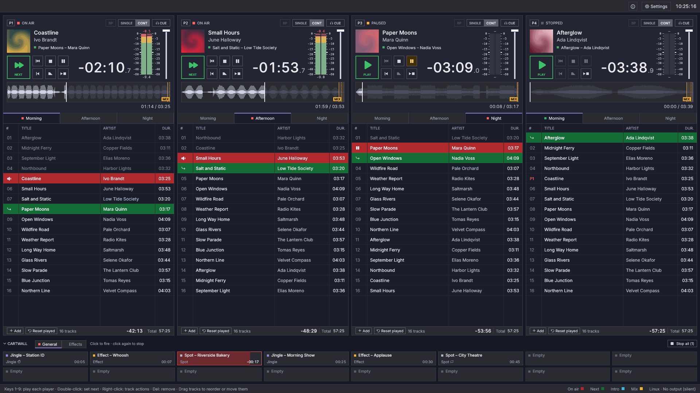

# Fauste Player — Erabiltzailearen gida

Gida hau AArekin itzuli da ingelesezko gidatik abiatuta (v0.5.0-120-g6932087, 6932087 commita), eta akatsak izan ditzake. Desberdintasunik badago, ingelesezko bertsioa da baliozkoa. <a href="../index.html" hreflang="en">Irakurri jatorrizkoa ingelesez</a>

Fauste Player irrati-estudioetarako emisio-aplikazio (playout) bat da.
Hainbat **erreproduzitzaile** independente exekutatzen ditu, bata bestearen
ondoan. Erreproduzitzaile bakoitzak bere zerrendak eta bere garraio-kontrolak
ditu. Erreproduzitzaileek pistak kateatu ditzakete nahasketa gainjarriekin,
aurrez entzun ditzakete aparteko **CUE** irteera batean, eta hutsegiteei eutsi
diezaiekete ezer bere kabuz airera atera gabe.

| Gida | Zer azaltzen duen |
|---|---|
| [Lehen urratsak](getting-started.md) | Instalazioa, lehen abiaraztea, musika gehitzea, erreproduzitzea |
| [Erreproduzitzaileak](players.md) | Erreproduzitzailearen zutabea: garraioa, moduak, atzerako kontaketa, uhin-forma, CUE |
| [Zerrendak](playlists.md) | Fitxak, pisten taula, arrastatu eta jaregin, testuinguru-menua, M3U/PLS fitxategiak |
| [Kartutxo-panela](cartwall.md) | Berehalako kartutxoak: jaurtitzea, orriak, begiztak, kartutxo esklusiboak, konfigurazioa |
| [Markatzaileak eta nahasketa](markers-and-mixing.md) | Cue-in/cue-out, MIX puntua, introa eta outroa, analisi automatikoa |
| [Ezarpenak](settings.md) | Audio-irteerak, erreproduzitzaileak, analisia, zerrendak, MIDI, urruneko kontrola |
| [Bit perfect irteera](bit-perfect.md) | Fitxategi bakoitzaren maiztasuna jarraitzen duten gailu esklusiboak, BP ikurra, DSD irteera, kate bat egiaztatzea |
| [Teklatua](keyboard.md) | Laster-teklak |
| [MIDI kontrol-gainazalak](midi.md) | MIDI kontrolagailuetako botoiak, faderrak eta argiak |
| [Urruneko kontrola](remote-control.md) | Fauste Player sarearen bidez erabiltzea: HTTP APIa, segurtasuna |
| [Datuak eta babeskopiak](data-and-backups.md) | Fitxategiak non gordetzen diren, gordetze automatikoa, hutsegite baten ondoko berreskuratzea, modu eramangarria |
| [Arazoen konponbidea](troubleshooting.md) | Soinurik ez, gailua galduta, erabilgarri ez gisa markatutako fitxategiak, erregistroak |

Interfazea ingelesez, gaztelaniaz, katalanez, nederlanderaz, frantsesez,
galizieraz, alemanez, italieraz, euskaraz, poloniarrez eta portugesez dago
eskuragarri. Sistema eragilearen hizkuntza jarraitzen du, Ezarpenak atalean
bat aukeratzen ez baduzu behintzat. Ingelesa eta gaztelania eskuz idatzita
daude; beste bederatziak AArekin sortu dira, eta akatsak izan ditzakete.
Horietako bat hitz egiten baduzu, zuzenketak ongi etorriak dira, issue edo
pull request gisa.

Gida beste hizkuntza batzuetan ere badago, ingelesezko gida honetatik
AArekin itzulita: [lineako gidan](https://sanchezfauste.com/fauste-player/guide/),
aukeratu bat goiko barrako globo-botoiarekin.
Itzulitako
orri batek hala dela adierazten du goialdean, eta ingelesezko orrira
estekatzen du; bien artean desberdintasunik badago, hori da erreferentzia.
