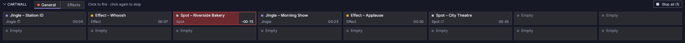

# Mur de cartouches

Le mur de cartouches est la bande de boutons sous les lecteurs. Chaque
bouton, une **cartouche**, joue un son instantanément : jingles, effets,
spots. Les cartouches jouent sur leurs propres sorties, indépendamment des
lecteurs.

## Utilisation {#using-it}

- **Cliquez sur une cartouche** pour la lancer. **Cliquez de nouveau dessus**
  pour l'arrêter.
- **Tout arrêter** (à l'extrémité droite de la barre) arrête toutes les
  cartouches en lecture, sur toutes les pages. Son libellé indique combien
  jouent, comme dans **Tout arrêter (2)** ; quand aucune ne joue, il est
  grisé et n'affiche aucun nombre.
- Pendant qu'une cartouche joue, sa bordure devient rouge, une barre rouge se
  réduit au fil de la lecture, et son temps décompte.
- Les cartouches **se superposent** par défaut : en lancer une deuxième
  n'arrête pas la première. Une cartouche réglée sur **Arrêter les autres
  cartouches au lancement** arrête d'abord toutes les autres cartouches à
  l'antenne, sur n'importe quelle page.
- Une cartouche réglée sur **En boucle** repart de son cue-in lorsqu'elle
  atteint sa fin, sans interruption, jusqu'à ce que vous l'arrêtiez.
- Un **clic droit** sur une cartouche donne plus d'options :

| Élément | Action |
|---|---|
| Pré-écouter sur le CUE | La jouer sur la sortie CUE du mur de cartouches (grisé quand le mur de cartouches n'a pas de sortie Cue distincte de sa sortie Main) |
| Arrêter | L'arrêter |
| Modifier… | L'ouvrir dans les Paramètres |

Le menu d'une cartouche vide ne contient que **Modifier…**, pour choisir son
fichier.

- **Pages :** les onglets à côté de **CARTOUCHES** changent de page. Un point
  rouge indique qu'une cartouche de cette page est en lecture.
- Cliquez sur **CARTOUCHES** pour replier la bande ou la déplier de nouveau.
- Quand la fenêtre est basse, les boutons rétrécissent (jusqu'à une hauteur
  minimale) pour que toutes les rangées configurées tiennent ; le mur de
  cartouches ne défile que lorsque même les plus petits boutons ne tiennent
  pas.

| Aspect du bouton | Signification |
|---|---|
| Point violet | Jingle |
| Point ambre | Effet |
| Point gris | Spot (publicité) |
| ↻ après le type | Joue en boucle |
| ✋ après le type | Arrête les autres cartouches au lancement |
| Fichier avec une croix / un signe d'avertissement | Le fichier est introuvable / ne peut pas être décodé ; survolez la cartouche pour voir la raison et le chemin. Un fichier introuvable est recherché de nouveau toutes les 30 s (`tuning.missing_recheck_ms`). |
| « Vide », grisé | Aucun fichier attribué |

Les cartouches utilisent les mêmes marqueurs que les pistes. Elles démarrent
à leur cue-in et se terminent à leur cue-out, que vous pouvez modifier sur la
forme d'onde d'un lecteur quand le fichier y est chargé.

## Clavier {#keyboard}

Par défaut, **F1**…**F12** lancent les cartouches 1 à 12 de la page affichée,
et **Ctrl+Space** arrête toutes les cartouches (comme **Tout arrêter** ; il
arrête aussi une cartouche que vous pré-écoutez sur le CUE, même si aucune
cartouche ne joue). Voir [Clavier](keyboard.md) pour les modifier.

## Configurer les cartouches {#setting-up-carts}

Allez dans **Paramètres → Cartouches** :

- **Pages :** créer, renommer, supprimer (la dernière page ne peut pas être
  supprimée) et définir la taille de la grille (lignes × colonnes). Une grille
  plus petite est refusée si elle ferait disparaître des cartouches qui ont
  un fichier.
- **Importer… / Exporter…** enregistrent une page dans un fichier
  `.cartpage.json` et la rechargent, par exemple pour la partager entre
  studios. Les chemins de fichier relatifs sont résolus par rapport au dossier
  du fichier.
- **Cartouches :** cliquez sur une cartouche dans la grille, puis définissez
  son nom, son fichier (**Choisir…** ou **Vider**), son type, **En boucle** et
  **Arrêter les autres cartouches au lancement**.

Les sorties Main et Cue propres au mur de cartouches se trouvent dans
**Paramètres → Sorties audio** (la ligne **Mur de cartouches**).
