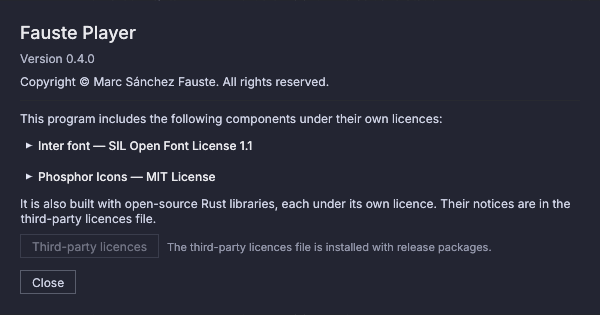

# Primi passi

## Installazione {#install}

Scarica un pacchetto per il tuo sistema dalla pagina **Releases** del
progetto. Ogni file ha accanto un file `.sha256`. Per verificare un download,
esegui `sha256sum -c <file>.sha256` su Linux, oppure
`shasum -a 256 -c <file>.sha256` su macOS.

### Linux {#linux}

| Pacchetto | Installazione | Aggiornamento | Rimozione |
|---|---|---|---|
| `.deb` (Debian, Ubuntu) | `sudo apt install ./fauste-player_<version>_amd64.deb` | installa il `.deb` più recente allo stesso modo | `sudo apt remove fauste-player` |
| `.rpm` (Fedora, openSUSE) | `sudo dnf install ./fauste-player-<version>-1.x86_64.rpm` | installa il `.rpm` più recente | `sudo dnf remove fauste-player` |
| AppImage (qualsiasi distribuzione) | `chmod +x fauste-player-<version>-x86_64.AppImage`, poi eseguilo | sostituisci il file | elimina il file |
| Bundle Flatpak | `flatpak install --user fauste-player-<version>-x86_64.flatpak` | installa il bundle più recente | `flatpak uninstall org.fauste.FaustePlayer` |
| Archivio | estrailo ed esegui `fauste-player` | estrai quello più recente | elimina la cartella |

- **Integrazione con il desktop:** i pacchetti aggiungono **Fauste Player** al
  menu delle applicazioni e ti permettono di aprire con esso le playlist
  `.m3u`, `.m3u8` e `.pls`, che vengono importate come nuove playlist.
- **Librerie necessarie:** le librerie ALSA e D-Bus. Ogni desktop le ha, e i
  pacchetti le dichiarano. JACK viene usato se è installato, e non è mai
  obbligatorio.
- **AppImage:** se non si avvia perché manca FUSE, eseguila con
  `--appimage-extract-and-run`.
- **Flatpak:**
  - Il bundle richiede il runtime freedesktop di Flathub. Se il remote
    Flathub non è configurato, esegui prima
    `flatpak remote-add --user --if-not-exists flathub https://dl.flathub.org/repo/flathub.flatpakrepo`.
  - La sandbox può leggere la tua cartella home (per riprodurre la musica
    dove si trova).
  - Riproduce tramite PulseAudio, oppure direttamente tramite ALSA per i
    dispositivi bit-perfect.
- **Librerie del desktop:** la finestra usa libxkbcommon e EGL o OpenGL, con
  Wayland o X11. Ogni desktop le ha, e il `.deb` e il `.rpm` le dichiarano.
  Su un sistema molto minimale, installale prima di usare l'AppImage.

### Windows {#windows}

Esegui `fauste-player-<version>-x86_64-pc-windows-msvc.msi`. Si installa per
tutti gli utenti in *Program Files* e aggiunge una voce al menu Start.
- **Aggiornamento:** esegui il programma di installazione più recente.
  Sostituisce la versione installata.
- **Rimozione:** usa **Impostazioni → App**.
- **Programma di installazione non firmato:** se la release non è firmata,
  SmartScreen avvisa di un editore sconosciuto. Scegli **Ulteriori
  informazioni → Esegui comunque**.

L'archivio `.zip` è un'alternativa portatile: estrailo ed esegui
`fauste-player.exe`.

### macOS {#macos}

Apri `fauste-player-<version>-macos-universal.dmg` e trascina **Fauste
Player** in **Applicazioni**. La stessa app funziona su Apple silicon e
Intel (macOS 11 o successivo).
- **Aggiornamento:** sostituisci l'app allo stesso modo.
- **Rimozione:** spostala nel Cestino.
- **App non firmata:** se la release non è firmata né notarizzata, macOS
  rifiuta il primo avvio.
  - macOS 15 e successivi: apri **Impostazioni di Sistema → Privacy e
    sicurezza**, scorri fino al messaggio su Fauste Player, scegli **Apri
    comunque** e conferma.
  - macOS 14 e precedenti: fai clic destro sull'app, scegli **Apri**, poi
    conferma.
  - Oppure esegui `xattr -dr com.apple.quarantine "/Applications/Fauste Player.app"`.
- **JACK su macOS:** un'app firmata e notarizzata può caricare solo una
  libreria JACK a sua volta firmata. Altrimenti JACK risulta non
  disponibile; usa Core Audio.
- **Playlist:** su macOS si importano da Impostazioni → Playlist. Aprire un
  file di playlist con l'app dal Finder non è supportato.

### Una sola istanza alla volta {#one-instance-at-a-time}

Per ogni cartella dei dati può essere in esecuzione una sola istanza di
Fauste Player. Se apri una playlist dal file manager mentre è in
esecuzione, quella playlist viene importata nell'applicazione in corso. Se
la riavvii senza playlist, compare un messaggio che dice che è già in
esecuzione. Per eseguire istanze separate affiancate (per esempio due studi
su un solo computer), dai a ciascuna una propria cartella con `FAUSTE_HOME`.

### Riga di comando {#command-line}

`fauste-player --version` stampa la versione. La barra del titolo della
finestra mostra il nome e la versione, e il pulsante **Informazioni su
Fauste Player** (un'icona di informazioni, a sinistra di **Impostazioni**)
apre la finestra «Informazioni su Fauste Player», con il copyright e le note
sulle licenze (**Licenze di terze parti** apre il file delle note installato
con i pacchetti di rilascio). In una lingua tradotta con l'IA, la finestra
dice anche che la traduzione può contenere errori. Chiudila con **Chiudi** o
con `Esc`. `fauste-player --help` elenca le opzioni. I file di playlist
passati come argomenti vengono importati come nuove playlist.

Su Windows il programma di rilascio non apre alcuna finestra della console:
`--version`, `--help` e gli errori di avvio compaiono invece in una finestra
di messaggio.

Quando un'impostazione richiede un riavvio, nella barra superiore compare
una pillola **Riavvio in sospeso**: premila per riavviare (vedi
[Impostazioni](settings.md#restart-pending)).

### Chiudere con audio in onda {#closing-while-audio-is-on-air}

Chiudere la finestra mentre qualcosa è in onda non chiude il programma. La
finestra viene in primo piano (anche se era ridotta a icona) e una
finestra di dialogo **C'è audio in onda** elenca ciò che sta suonando: i
lettori in riproduzione o in pausa (`P1 — titolo`) e i cart in
riproduzione con il loro numero nella pagina (`Cart 3 — titolo`). Il CUE di
un lettore o della cartwall non conta. Scegli **Annulla** (oppure `Esc`, o
fai clic fuori dalla finestra di dialogo) per continuare a riprodurre, o
**Ferma e chiudi** per fermare ogni lettore in onda e tutti i cart e poi
uscire. La sessione viene salvata come in qualsiasi altra uscita. Senza
nulla in onda la finestra si chiude subito. La finestra di dialogo ha la
precedenza su Impostazioni e su Informazioni su Fauste Player, e le scorciatoie da tastiera non
fanno nulla finché è aperta (i comandi MIDI e remoti agiscono comunque).

## Primo avvio {#first-start}

La finestra si apre con quattro lettori, ciascuno con una playlist vuota.
Nulla suona finché non premi Play: vale anche dopo un riavvio o un crash.

## Aggiungere musica {#add-music}

- Fai clic su **+ Aggiungi** in fondo a un lettore e scegli i file, oppure
- trascina file audio o cartelle dal tuo file manager su un elenco di
  brani. Le cartelle aggiungono i file audio che contengono direttamente,
  non le loro sottocartelle.

Formati supportati: WAV, AIFF, CAF, FLAC, MP3 (e MP1/MP2), AAC/M4A, ALAC, Ogg Vorbis, Opus, WavPack, Monkey's Audio (APE), DSD (DSF e DFF) e audio Matroska (MKA).
I file DSD vengono riprodotti convertiti in PCM alla loro frequenza divisa
per 32 (88,2 kHz per il DSD64), oppure inalterati come DoP o DSD nativo su
un dispositivo bit-perfect impostato in tal senso (vedi
[Uscita bit-perfect](bit-perfect.md#dsd)). L'Opus suona sempre a 48 kHz. I
file WavPack devono essere lossless e mono o stereo; i WavPack ibridi e
multicanale risultano illeggibili, come i file DFF compressi con DST.

Ogni file viene analizzato in background. L'analisi legge titolo, artista,
album e copertina, disegna la forma d'onda e trova dove inizia e finisce il
suono e dove mixare nel brano successivo. Puoi riprodurre un brano prima che
la sua analisi finisca.

## Riprodurre {#play}

- Premi **Play** (o il tasto numerico del lettore, `1` per P1) per avviare
  il brano **successivo**, segnato in verde nell'elenco.
- Premi di nuovo **Play** mentre un brano è in onda per passare in
  dissolvenza al successivo.
- Fai **doppio clic** su un brano per impostarlo come successivo.

In modalità **CONT** (continua) il lettore passa da solo al brano successivo
con un mix al punto MIX. In modalità **SINGLE** si ferma alla fine di ogni
brano. Continua con [Lettori](players.md).
