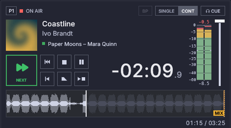
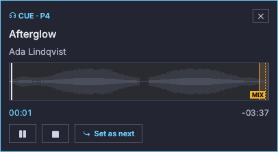

# Players

Each column is one player. Players are independent: each has its own
playlist tabs, transport, volume and outputs.

## Header

| Element | Meaning |
|---|---|
| `P1` … `Pn` | Player number (the number key that plays it) |
| Status dot and label | **On air** (red), **Paused** (amber), **Stopped** (grey) |
| **Mixing** / **Fading** badge | A crossfade into the next track, or a fade stop, is running |
| **Stop after** badge | The player stops when the current track ends |
| **Repeat** / **Stop after track** badge | The current track repeats, or stops the player when it ends, because of its own mark in the playlist menu. Hover for the full sentence. The player's own **Stop after** button wins: while it is on, only its badge shows |
| **BP** / **DSD** | **BP** is lit while the current track reaches its Main device unchanged. **DSD** replaces it while a DSD track goes out as DSD, unchanged (see [Bit-perfect output](bit-perfect.md)). **Others muted** shows beside it when that DSD stream keeps other sources off the output |
| **SINGLE** \| **CONT** | Play mode (see below): one joined control, the lit half is the active mode |
| **CUE** | Pre-listen the next track on the CUE output |

## Info row

- **Cover** of the track on air, or a vinyl placeholder.
- **Title and artist** of the track on air. A stopped player shows the
  track Play will start (its next), with its cover, its length and its
  waveform, ready at the cue-in.
- **Stereo meter** (in the column at the right of the player, next to the
  fader; it spans the info row and the transport): the level the player
  puts out, after its volume.
  - One continuous bar per channel, on the scale of the meter type's
    standard (the digital peak meter by default: −60 to 0 dBFS, with the
    top 20 dB taking half the height). The scale is labelled on the left:
    its top and its bottom (for the digital meter, the scale floor) are
    always marked, and every label has a line across both bars. The lines
    are light over the empty part of a bar and show as dark cuts over the
    lit part, so they stay readable at any level; two short notches at the
    outer edges of the bars mark the alignment level (−18 dBFS).
  - The bar is green, yellow from the warning level (−9 dBFS), and red
    from the danger level (−3 dBFS). The other meter types turn red where
    their scale does (from 0 VU, from the permitted maximum on a PPM).
  - K-System meters show two sections: the solid bar is the average (RMS)
    level and the dimmer part above it reaches the peak. Their colours are
    the K-System's: green below 0, amber from 0 to +4, red above.
  - Digital peak, K-System and custom meters keep the highest level lit for a
    moment as a line (the peak hold; its length is **Peak hold** in
    [Settings → Meters](settings.md#meters), and 0 turns it off). EBU PPM,
    DIN PPM and VU meters have no hold.
  - The number above is the highest level since the entry started, in
    dBFS, red in the danger zone. It stays after a stop and starts again
    when an entry plays (the next one or the same again), or when you
    click it.
  - The number underneath is the loudness in LUFS (EBU R128), green within
    ±1 LU of the target (−23 LUFS).
  - The meter type and every level can be changed in
    [Settings → Meters](settings.md#meters).
  - **Readings above 0 dBFS.** The meter shows what the player puts out, and
    that can exceed full scale. The bar stops at the top of the scale, so
    the same red shows 0 dBFS and anything above it; only the number above
    tells how far, with its sign (for example `+3.5`).
    - A file can carry levels above full scale itself (a float file, or a
      lossy file whose decoded peaks exceed it).
    - Converting the rate can create peaks between the samples: a signal
      that touches 0 dBFS reads about +3 dBFS after 44.1 → 48 kHz. The
      true-peak option reads those peaks too.
    - The meter reads each player alone, not the sum on the device: two
      players on one output can add up above full scale without either
      meter showing it.
    - Nothing in the player adds gain above 100 %. An integer device clips
      at full scale; a float device receives the level as it is and the
      sound system or driver clips it.
- **Volume fader** (right of the meter, as tall as it): drag it or use the mouse wheel, one step per notch. The
  tooltip shows the level in dB; the top is 0 dB and the bottom is silence.
- **Title, artist** and the **next** line, with a green square. While CUE is
  on, the pre-listen position shows in blue.

## Transport

| Button | Action |
|---|---|
| **Play / Next** (large) | Stopped: start the next track. On air: fade into the next track (the fade time is set in [Settings](settings.md)). Paused: resume. With the track on air as next, Play restarts that track with the usual fade. |
| **Stop** | Stop at once (with a short de-click ramp) |
| **Fade stop** | Fade out and stop |
| **Pause** | Pause or resume; blinks amber while paused |
| **Stop after** (a play triangle then a square) | Stop when the current track ends, once. In SINGLE mode it is available only while the current track repeats: it ends the repeat when the pass that is playing ends. To stop after a track every time it plays, or to repeat a track, use its menu in the playlist (see [Playlists](playlists.md)) |
| **Previous** (a bar and two triangles) | While on air: fade back into the track this player played before, as Next does. Press again to keep going back. The track you left becomes the next one. |
| **Restart** (a bar and one triangle) | Back to the start of the current track (its cue-in). A paused player stays paused. |

Buttons that cannot act right now are dimmed: Stop and Restart with nothing
loaded, Pause and Fade stop while stopped, Previous with no earlier track or
during a fade. A player remembers the last 50 tracks it played
(`players.history_len` in `config.json`, 0 to 1000).

## Modes

- **CONT (continuous):** at the MIX point the player starts the next track
  and overlaps the end of the current one. See
  [Markers and mixing](markers-and-mixing.md).
- **SINGLE:** every track stops at its end. *Stop after* is not available in
  this mode, because every track already stops, except while the current
  track repeats: then it ends the repeat when the pass that is playing ends.

## Countdown

The large number is the time left until the end of the track (its cue-out),
with tenths. The elapsed time and the total are on the row under the
waveform, on the right. During the last
seconds before the end (10 by default, set in Settings) the countdown blinks
red.

## Waveform

- The part already played is drawn in the waveform colour; the rest is dimmer.
- The outline shows the peaks, faint; the solid body inside it is the average
  (RMS) level. On a loud track the peaks fill the height, and the body still
  shows where the track is quieter or louder.
- A blue shaded area at the start marks the **intro**, and a badge counts it
  down. The intro only shows when it has been set.
- An orange shaded area at the end marks the **outro**, with its own countdown.
- A dashed amber line with a **MIX** tag marks where the next track starts in
  continuous mode. It is dimmed in single mode.
- The whole file is drawn. The silent start and end that playback skips (before
  cue-in and after cue-out) are drawn darker, with a thin line where playback
  starts and ends. With **Use cue-in and cue-out** off (Settings → Players)
  nothing is darker and the two lines are dimmed: playback runs from the start
  to the end of the file, and the cue-in and cue-out in this guide mean those
  two ends.
- Hover to see the time under the pointer. **Click to jump** there (while
  playing or paused; a stopped player always starts at the cue-in). A click is
  a press and release without moving the pointer more than a few pixels.
- **Press and drag** moves the zoomed view along the track, like grabbing it.
  A drag never jumps, and without zoom it does nothing. Alt-drag still edits
  markers.
- **Mouse wheel** over the waveform: zoom in and out around the pointer, down
  to the finest detail the analysis has. **Shift+wheel** (or a sideways wheel)
  moves along the track. While zoomed, the view follows the playing position,
  except for 10 seconds after you zoom or move it
  (`ui.follow_current_grace_secs`; 0 turns following off). **Full view**, in the top-right corner,
  zooming all the way out or a new track show the whole track again.

## CUE (pre-listen)

Pressing **CUE** (or **Pre-listen on CUE** in a track's menu) plays the track
on the player's CUE output, for example headphones, without touching the
on-air output, and opens a small **CUE window** for that player. Several
windows can be open, one per player. See [Settings](settings.md) to choose
the CUE device. A player needs a Cue output that is not its Main output:
without one, **CUE** and **Pre-listen on CUE** are dimmed, and hovering them
says so.

The window shows:

- the title and artist;
- the waveform of the whole file with the CUE position; click it to jump
  there;
- the elapsed time and the time remaining to the end of the file (a CUE plays
  whole files);
- **Pause** / **Resume**, **Stop** and **Set as next**. **Set as next**
  makes the cued track the player's next and keeps the CUE playing. It is dimmed when the track already is the next. If the
  cued track is the one on air, it plays once more when the current pass
  ends.

A jump on a paused CUE keeps it paused. The close button of the window, or
**Stop**, stops the CUE.

While a CUE runs, setting a next (double-click) or a single click on a row
moves the CUE to that track, from its cue-in; if it was paused, it plays
again. A track whose file is missing or unreadable leaves the CUE where it
is.
