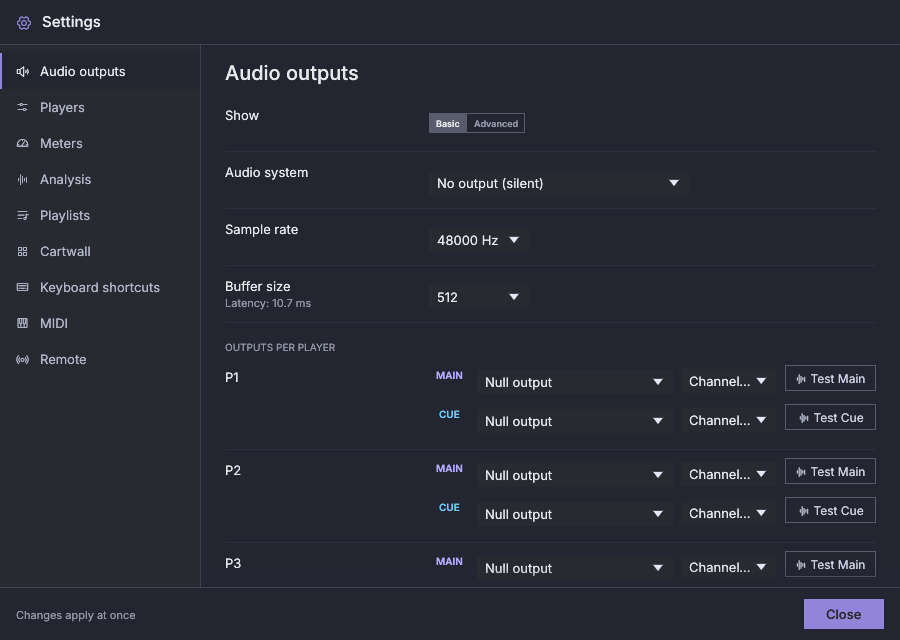
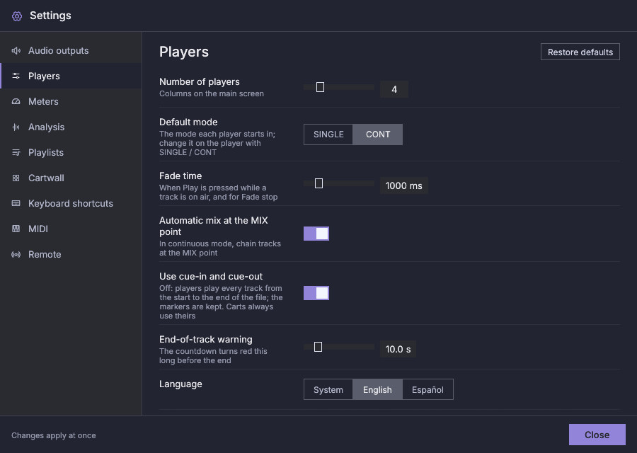
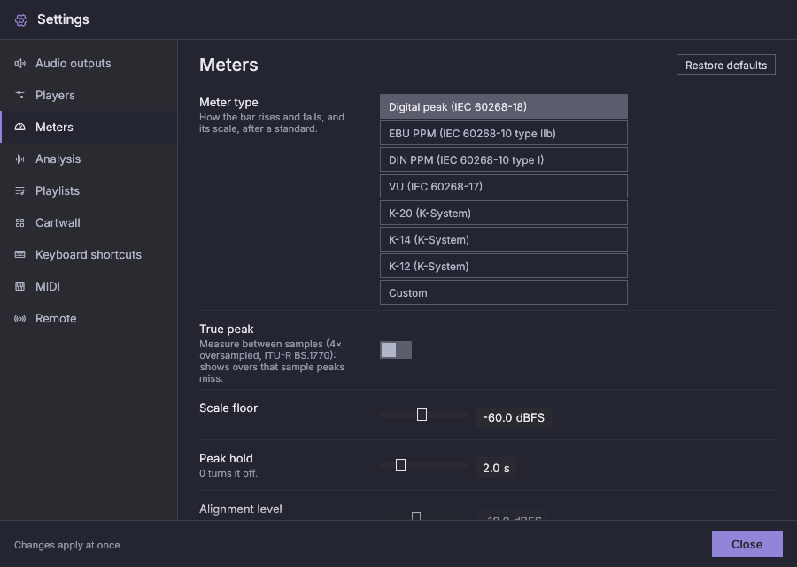
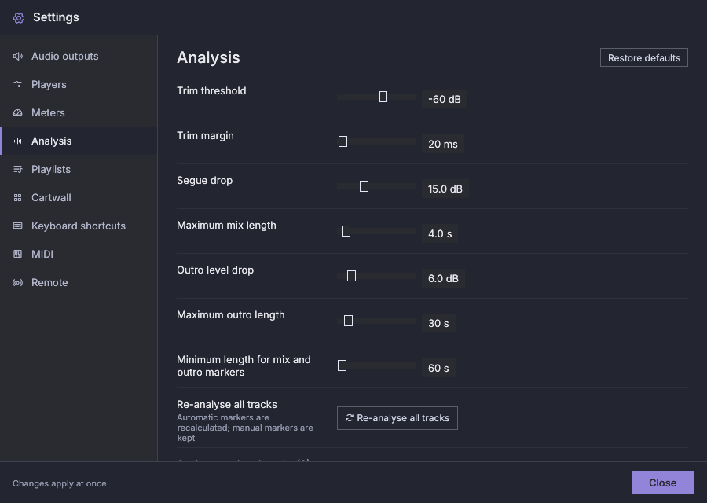
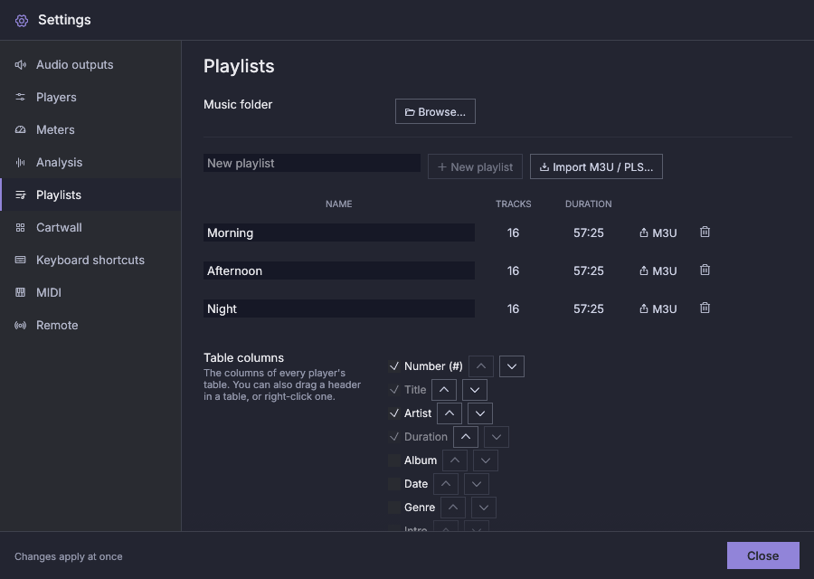
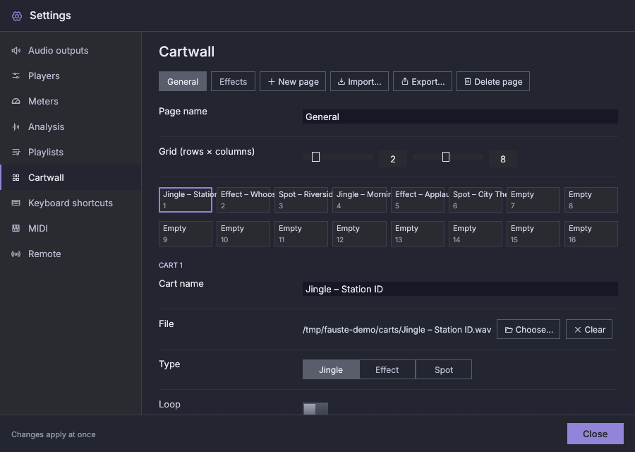
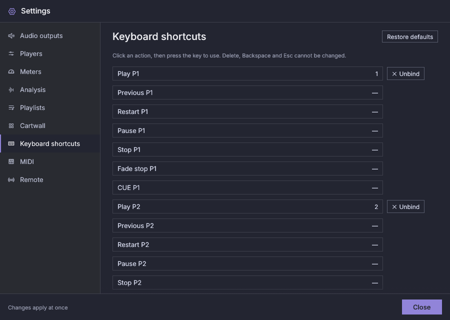
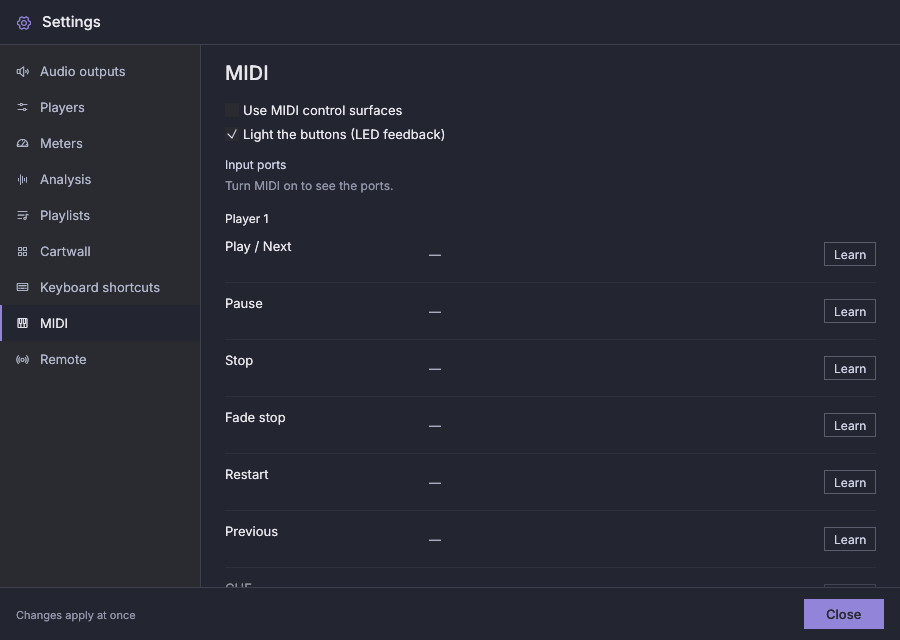
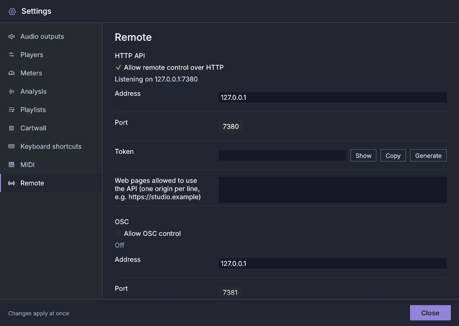

# Settings

Open **Settings** in the top bar. Close it with **Close** or `Esc`. Most
changes apply at once and are saved automatically.

The window has one size (900 × 640, smaller on a small screen) whatever the
section, and the section scrolls inside it. Every section lines its labels up
in one column.

The Players, Meters, Analysis and Keyboard shortcuts sections have a
**Restore defaults** button in their header. It asks for confirmation and then
resets only that section (Players keeps the number of players and the
language; Shortcuts has no other reset button). Audio outputs, Playlists,
Cartwall, MIDI and Remote have none.

## Settings pending

Every setting applies while the application runs. The audio system, the
sample rate, the buffer size (also a device's own), the Main and Cue outputs
(players and cartwall), the bit-perfect devices and the DSD settings change
how an output device is opened, so they apply as soon as that is safe:

- A device's settings apply when nothing plays on that device: no player
  routed to it is playing, fading or pre-listening (CUE, also when held),
  and no cart plays on it. A paused player, or one with a track only loaded,
  does not hold a device: its track stays paused where it was.
- A player's or the cartwall's output moves when that player (or the
  cartwall) is not playing; other players on the same devices are not
  interrupted.
- A new audio system applies when nothing plays anywhere.

A waiting change runs at the first moment nothing it affects plays. That
can be the gap between one track ending and the next starting: the next
track then starts later by the time the device takes to reopen. **Apply
now** (below) forces the change at once instead.

A rate or buffer given to a device counts only when it changes what the
device opens with: giving a device the same value as the global one, or
clearing such a value, changes nothing.

Until then the top bar shows **Settings pending**. Hover it to see what
waits and on what; click it for the list, which also shows any change a
device or output refused (the device keeps its current settings; the change
is tried again when you change it or press **Apply now**). The Settings
footer says "Some changes wait until the outputs they affect are free." and
offers **Apply now**; a short notice (for example, that a setting was saved)
can take the place of that text for a moment.

**Apply now** applies every waiting output change at once. When that would
interrupt something, it first lists the devices and what plays on them;
**Interrupt and apply** then briefly interrupts the audio on those devices:
what was playing goes on from where it was after a short gap, and nothing
paused or stopped starts. **Cancel** (or `Esc`) keeps waiting.

The limits and the engine tuning are edited in the configuration file with
the application closed (see [Data and backups](data-and-backups.md)).

## Audio outputs

Changes in this section apply while the application runs, as soon as nothing
they affect is playing: see [Settings pending](#settings-pending).

At the top, **Show** chooses **Basic** or **Advanced**. Basic shows the
audio system, the sample rate, the buffer size and the outputs. Advanced
adds, for each device an output uses, its own rate and buffer, the
bit-perfect switch and the DSD mode, and then the DSD settings. Switching
views only shows or hides rows: nothing is changed or reset. When Basic
hides a setting that is in use, a line says so. When no output uses a
device any more, its own rate and buffer, its bit-perfect switch and its
DSD mode are forgotten the next time the application starts: if an output
uses it again after that, it starts from the global values. Until then,
choosing it again (for example after swapping two devices) keeps them.

| Setting | Meaning |
|---|---|
| Audio system | The last choice, **No output (silent)**, plays nothing: timelines run at real-time pace with no sound card (for a machine without one, or to rehearse). Linux: PipeWire (in builds that include it), PulseAudio, JACK or ALSA. Windows: WASAPI, ASIO (in builds that include it) or JACK. macOS: Core Audio or JACK. Systems missing on this computer, or with no output device (a JACK server that is not running), are shown as unavailable. "System default" uses the first available one in that order. |
| Sample rate | The rate every output runs at unless a device has its own (Advanced); files are converted to it with high-quality resampling. Bit-perfect devices start at their rate and then follow the files. |
| Buffer size | Frames per audio block, unless a device has its own; the resulting latency is shown below it |
| Outputs per player | For each player, a **Main** (on-air) device and a **Cue** (pre-listen) device, each with a channel pair. A sound card that offers several output profiles (ALSA lists front, surround, direct hardware…) shows each as *card — profile*; two entries that would still read the same get their device id in brackets. Multichannel interfaces can carry several players on different pairs. |
| Test Main / Test Cue | Plays a short tone (1 kHz on Main, 440 Hz on Cue, 1.5 s, −18 dBFS) on the chosen output, so you can check the wiring before going on air |
| Cartwall | The cartwall's Main and Cue outputs. Main defaults to the system output. Without a Cue there is no cart pre-listen. |
| Sample rate: *device* (Advanced) | **Global (...)** uses the sample rate above; a value gives this device its own rate. Only the rates the device reports are offered; a saved rate it no longer reports stays listed with a note that it may not open (the device then falls back to the global rate). The own values apply only to devices an output names, not to the system default output unless one does. |
| Buffer size: *device* (Advanced) | **Global (...)** uses the buffer size above; a value gives this device its own, with its latency below. A device that does not take its own buffer size falls back to the global one, and to the global rate too when it does not take its own rate either. |
| Bit-perfect: *device* (Advanced) | A bit-perfect device is opened with exclusive access and follows each file's sample rate while nothing plays on it. The switch is disabled where the device cannot give exclusive access. See [Bit-perfect output](bit-perfect.md). |
| DSD: *device* (Advanced) | **Convert to PCM** (the default), **DoP** or, on Linux, **Native DSD**. Every device shows it; only the modes the device can take are offered, and a line under it says why the others are not. See [DSD](bit-perfect.md#dsd). |
| When another source needs a DSD output (Advanced) | **Continue the DSD track as PCM** (the default), or **Keep DSD and mute the other sources**. See [DSD](bit-perfect.md#dsd). |
| DSD silence (Advanced) | Silence sent before a DSD stream starts, after it ends and on a switch to PCM, so that the converter locks without a click; 200 ms by default, 0 to 2000. |

A Cue output never falls back to the output Main uses, so that pre-listening
never goes on air. A Cue that names a device on an audio system this
computer does not have, or the same output (device and channels) as Main,
means "no cue". When a Cue output is the same as its Main output, a warning
under it says so. A player with no Cue output, or with its Cue on its Main
output, has its **CUE** button dimmed; hovering it tells you to choose a Cue
output here. The same goes for the cartwall's **Pre-listen on CUE**.

If a device disappears while playing, the players keep their timelines, and
the device is reopened when it comes back (see
[Troubleshooting](troubleshooting.md)).

## Players

| Setting | Default | Meaning |
|---|---|---|
| Language | System | Interface language |
| Number of players | 4 | Columns on the main screen (a player on air cannot be removed) |
| Default mode | CONT | The mode players start in |
| Fade time | 1000 ms | Used by Play while on air and by Fade stop |
| Automatic mix at the MIX point | On | Overlap tracks in continuous mode |
| Use cue-in and cue-out | On | Off: players play every track from the start to the end of the file; the markers are kept and carts still use theirs. Durations and playlist totals follow the same range |
| End-of-track warning | 10 s | When the countdown starts blinking red |

## Meters

Changes apply at once. Settings shows only what the chosen meter type
uses: the EBU, DIN and VU meters have the scale, red zone and behaviour
their standard fixes (only the alignment level is set), and a K-System
meter's alignment is its own 0. A value you set is kept for when you
choose that type again.

| Setting | Default | Meaning |
|---|---|---|
| Meter type | Digital peak | How the bar rises and falls, and its scale, after a standard (see below) |
| Rise time, Fall rate | 5 ms, 11.8 dB/s | Only for **Custom**. The rise time is an integration time: a tone burst that long reads 2 dB low; 0 shows every peak. |
| True peak | Off | Digital peak, custom and K-System only. Measure between samples, with the 4× oversampling filter ITU-R BS.1770 publishes. It shows peaks that exceed 0 dBFS after conversion, which a sample-peak meter misses. As the standard allows, an isolated one-sample click can read up to about 0.3 dB below its sample value. |
| Scale floor | −60 dBFS | The bottom of the digital scale (digital peak and custom). The other meters show the range their standard gives. |
| Peak hold | 2 s | Digital peak, custom and K-System only: how long the highest level stays lit; 0 turns it off. Programme meters and the VU have no hold. |
| Alignment level | −18 dBFS | All but the K-System. Marked on the scale (EBU R68). It is also where the EBU TEST mark, the DIN −9 mark and 0 VU sit. |
| Warning from | −9 dBFS | Yellow from here (EBU permitted maximum), for the digital peak and custom meters |
| Danger from | −3 dBFS | Red from here, for the digital peak and custom meters. The others turn red where their scale does: VU from 0 VU, EBU and DIN PPM from the permitted maximum (EBU +9, DIN 0), the K-System from +4. |
| Loudness readout | Short-term | The loudness under the meter: off, momentary (last 400 ms) or short-term (last 3 s), EBU R128 |
| Loudness target | −23 LUFS | The readout is green within ±1 LU (EBU R128) |

| Meter type | Standard | Behaviour |
|---|---|---|
| Digital peak | IEC 60268-18 | Shows every peak at once; falls 20 dB in 1.7 s |
| EBU PPM | IEC 60268-10 type IIb | Peaks shorter than about 10 ms read lower (a 10 ms tone burst reads about 1.6 dB low, a 0.5 ms one about 18 dB low), within EBU Tech 3205's tolerances; falls 24 dB in 2.8 s |
| DIN PPM | IEC 60268-10 type I | The same with a 5 ms integration time; falls 20 dB in 1.5 s |
| VU | IEC 60268-17 | The average level, with the needle movement of a VU meter: 99 % in 300 ms, with a slight overshoot; a sine reads its peak level |
| K-20, K-14, K-12 | K-System | Two sections: the average (RMS, 600 ms) as the solid bar and the peak (falls 26 dB in 3 s) dimmed above it. 0 is 20, 14 or 12 dB below full scale; green below 0, amber from 0 to +4, red above. K-12 suits broadcast, K-14 and K-20 more dynamic programme. |
| Custom | — | Your rise time and fall rate |

Each meter uses the scale of its standard, with its marks between the
channels:

| Meter | Scale |
|---|---|
| Digital peak, custom | −60 … 0 dBFS, marks every 10 dB down to −40 and every 5 dB above; the top 20 dB take half the height |
| EBU PPM | −12 … +12 around the alignment level (TEST), every 4 dB; quieter levels rest at the bottom |
| DIN PPM | −50 … +5, where 0 is 9 dB above the alignment level (−9 dBFS by default) |
| VU | −20 … +3 VU, 0 VU at the alignment level; the bar moves in proportion to the voltage, like the needle |
| K-System | from +20, +14 or +12 (0 dBFS) down to −60; even in dB down to −24 |

## Analysis

The thresholds described in [Markers and mixing](markers-and-mixing.md).
**Re-analyse all tracks** runs the analysis again for the whole library;
manual markers are kept.

After an update whose analysis has changed, tracks analysed by the earlier
version keep their markers and waveforms, which still work. At start,
Fauste Player says how many there are and offers **Analyse now** or
**Later**; **Analyse outdated tracks (N)** here does the same at any time.
The tracks on the players are brought up to date anyway, as they are
shown, and so are the tracks of carts that have no recorded format (a cart
plays bit-perfect only when its format is known). Tracks whose file is
missing are not counted until the file is back.

## Playlists

- **Music folder:** where the file dialogs start.
- **New playlist**, **rename** (edit the name and press Enter; Esc cancels)
  and **delete** (trash icon).
- **Import M3U / PLS…** creates a new playlist from a playlist file. **M3U**
  on each row exports it as M3U8. See [Playlists](playlists.md).
- **Table columns:** which columns the track tables show and in which order,
  for every player: a checkbox per column (Title and Dur. cannot be turned
  off), up and down arrows for the shown ones, and **Default columns**. See
  [Playlists](playlists.md).

**Language:** a drop-down list: **System** (follow the operating system),
then every language the interface is available in, each in its own name
(English first, then alphabetically: for example Español). The interface
switches at once. A system language with no translation of its own uses the
closest one (Canadian French uses French, Brazilian Portuguese uses
Portuguese), and English otherwise. A language in the settings file that
the interface does not have shows as **System** and follows the operating
system.

English and Spanish are written by hand. The other translations were
generated with AI and may contain errors; when one of them is in use,
**About** says so. Corrections from native speakers are welcome as issues
or pull requests.

## Cartwall

Pages, grid size, the cart editor, and cart page import and export. See
[Cartwall](cartwall.md).

## Keyboard shortcuts

See [Keyboard](keyboard.md).

## MIDI

Turn MIDI control surfaces on, see the input ports, and learn a control
for each player action. See [MIDI control surfaces](midi.md).

## Remote

Remote control over the network, for web pages, phone apps, automation and
control surfaces. See [Remote control](remote-control.md).

- **Allow remote control over HTTP**, its **address** and **port**, and a
  line that says whether it is listening.
- **Token**, required beyond this computer. **Generate** makes a random one,
  **Show** reveals it, and **Copy** puts it on the clipboard. A warning
  appears when the address reaches beyond this computer and there is no
  token.
- **Web pages allowed to use the API**: one origin per line.
- **Allow OSC control**, its **address** and **port**, and the **senders
  allowed** (addresses or subnets, one per line).
- **Publish times every**: how often elapsed and remaining times are sent
  while something plays.

Text fields and numbers apply when you leave them, which includes opening
another section or closing Settings; Esc cancels what you were typing. An
invalid value is corrected, and the field shows what was kept.
